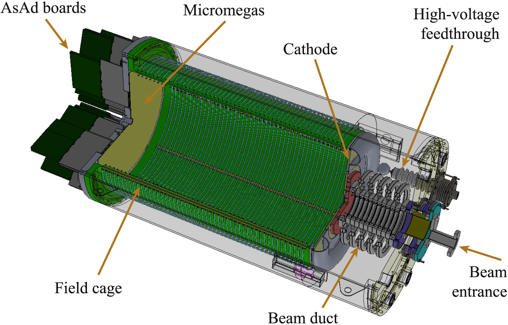

In order to be able to inspect the AT-TPC data, it may be helpful to first take a look at what the AT-TPC looks like physically; this will help us understand why certain quantities would be conserved. 

<figure style="text-align: center;">
    
    <figcaption>Figure 1: A schematic view of the AT-TPC detector</figcaption>
</figure>

From the Fig. 1, we can see that this detector is cylindrical, where the beam axis is typically set as the z axis. The "active" part of the detector corresponds to a gas being used as the target, therefore this is a gaseous detector. Due to this reason, we use inverse kinematics&mdash;where the heavy particle is the beam and the lighter in a gas form inside the detector. 

For the purposes of this work, I will only be looking at data that is derived from a particular experiment. 

$$
^{16}\text{O} + \alpha
$$

An ionized beam, where electrons are stripped off, of $^{16}\text{O}$ comes in through the beam entrance and enters the active volume of the detector, the beam interacts with the gas and creates charged particles that in turn ionize the gas&mdash;creating electrons. These electrons drift to the end of the detector, moved by the electric field being point that way and the magnetic field (a solenoid magnet around the detector) curving the path of the particles. The electrons get sensed by the pad plane, creating a 2-D image; we can get another dimension through the beam axis by converting the drift velocity of the electrons into position&mdash;finally getting 3-D images of the reactions. Depending on the event (reaction), there are any number of tracks (charged particles) and our data can be seen in the form of point clouds, which are higher dimensional tensors. 

If you would like to know more about why we decided to stray into the forest of ML, you can read about it on [this page](why_ml.md).
