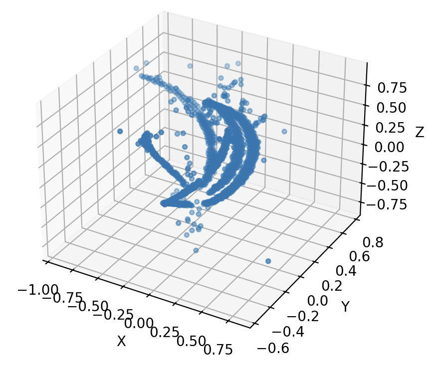

One may puzzle at the connection between our data and machine learning, and they would be fair to do so. It will be useful, perhaps, to see what the data looks like.

<figure style="display: flex; justify-content: space-between;">
    
    
    
</figure>

<figure style="display: flex; justify-content: space-between;align-items: center;">
    
    
</figure>

<figcaption style="text-align: center;">Figure 2: Point clouds for different categories of events</figcaption>

Applied ML research has many avenues of implementation and a substantial pick of tools; convolutional neural networks (CNN) have had some recent development in image based research, and fortunately for us, our data closely mimics an image. Fig. 2 shows the different categories of events corresponding to different types of reactions, and they could be considered classes for a classification model, which is the route we have chosen to take. 

Though our data looks like an image, normally used for CNN, it is not exactly an image. Fig. 3 shows how a CNN would work with an image, but it also shows that the data must be in a form of binary arrays. 

<figure style="display: flex; justify-content: center;">
    
</figure>
<figcaption style="text-align: center;">Figure 3: Convolutional Neural Network   <a href="https://glassboxmedicine.com/2020/08/03/convolutional-neural-networks-cnns-in-5-minutes/" style="font-size:15px;"> [Image Source]</a></figcaption>

This not what our data looks like, in fact, our data is more like a high dimensional tensor&mdash;shown in Fig. 4&mdash;where each point in a singular point cloud that has x,y,z position coordinates and charge. We have multiple runs, and each run has many events, where each event has different amounts of points that have the same four properties; well we have more, but these are better suited for the purposes of training our model. 

<figure style="display: flex; justify-content: center;">
    
</figure>
<figcaption style="text-align: center;">Figure 4: AT-TPC data tensor</figcaption>

Fortunately, there have been recent developments in machine learning architecture specifically for point cloud data, we will be using one of these neural network called PointNet. You can learn more about this architecture [here](about_pn.md).

However, this doesn't explain our need for using ML techniques or how we would apply it in our analysis process. Our current analysis involves using a complex algorithm called [Spyral](https://attpc.github.io/Spyral/). This involves many phases and steps, but the step of relevance in our context includes a clustering algorithm called HDBSCAN ([more information here](https://scikit-learn.org/stable/modules/generated/sklearn.cluster.HDBSCAN.html)). This clustering, though extremely helpful for most of our data (1 or 2 track events), isn't the best at clustering the rare multi-track events (3 or higher tracks). The particular experiment I am studying necessitates finding five track events&mdash;corresponding to a specific type of decay involving five $/alpha$ particles. 

<figure style="display: flex; justify-content: center;">
    
</figure>
<figcaption style="text-align: center;">Figure 5: Kinematics plot of AT-TPC data, with a red box indicating problematic points</figcaption>

Fig. 5 shows evidence of where we know our current analysis fails, the red box indicated point we should not see but still do. Furthermore, the events I am interested in lie between 10-60 degrees and are very rare, other events with one or two tracks&mdash;greatly abundant in our data&mdash;hide the events of insert. If I was able to sort only the five track events *prior* to the analysis, I would not only be able to remove the events not of importance but also increase the efficiency of our analysis (since I would be analyzing less data).